<div align="center">
  
</div>

<br/>

<p align="center">
  
</p>

<br/>

```python
rohit = {
    "name"      : "Rohit Michael Raj",
    "college"   : "VIT Chennai  |  CSE '27  |  24BCE5108",
    "research"  : "LSTM/Transformer for Earth–Moon transfer trajectory classification",
    "building"  : ["OrbitGuard", "multi-agent AI orchestration", "trajectory ML"],
    "hackathons": ["DevsHouse '26 — Visceral/ClimateScope",
                   "Red Bull Basement — Sendr",
                   "fintech hackathon — Munshi AI"],
    "stack"     : ["Python", "PyTorch", "C", "Flask", "MySQL", "GMAT R2025a"],
    "interests" : ["aerospace ML", "LLM infra", "cinema", "watches"],
}
```

<br/>

---

### 🛠 stack

<br/>

**languages**


**ml / research**


**tools & infra**


<br/>

---

### 📊 stats

<br/>

<div align="center">
  
  &nbsp;&nbsp;
  
</div>

<br/>

<div align="center">
  
</div>

<br/>

---

### 🛰️ selected work

<br/>

| project | what | stack |
|---------|------|-------|
| **[OrbitGuard](https://github.com/rohitmichael-alt)** | LSTM-based anomaly detection for spacecraft telemetry — flags degradation before failure | Python · PyTorch · GMAT R2025a |
| **Visceral / ClimateScope** | AR climate visualization — DevsHouse '26 hackathon | React · Three.js |
| **Munshi AI** | WhatsApp-native financial assistant for India using AA/OCEN/GSTN framework | Python · WhatsApp API |
| **Sendr** | AI trick recognition for action sports — Red Bull Basement '25 | CV · Python |
| **Trajectory ML** | LSTM/Transformer early-exit classifier for Earth–Moon transfer — Springer target | Python · PyTorch · GMAT |

<br/>

---

### 📡 reach

<br/>

<div align="center">
  <a href="mailto:your-email@gmail.com">
    
  </a>
  &nbsp;
  <a href="https://linkedin.com/in/your-linkedin">
    
  </a>
  &nbsp;
  
</div>

<br/>

<div align="center">
  
</div>
